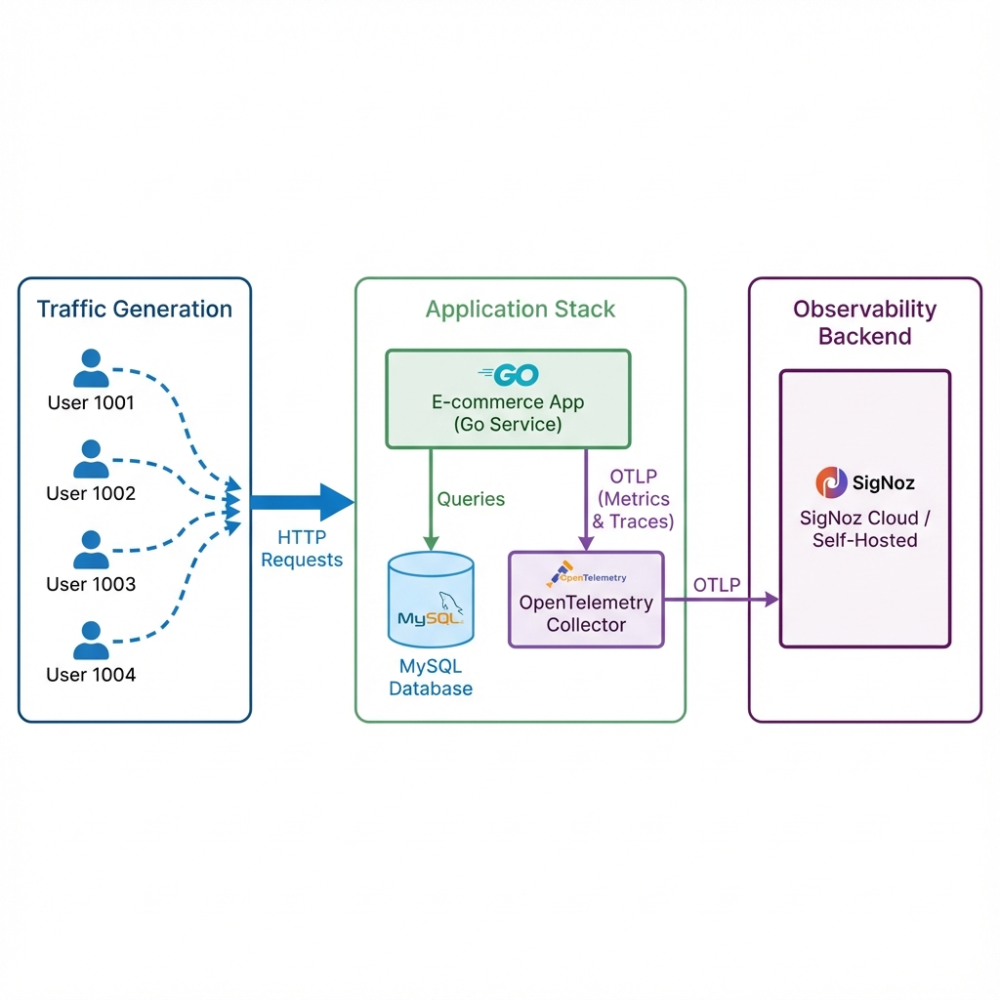
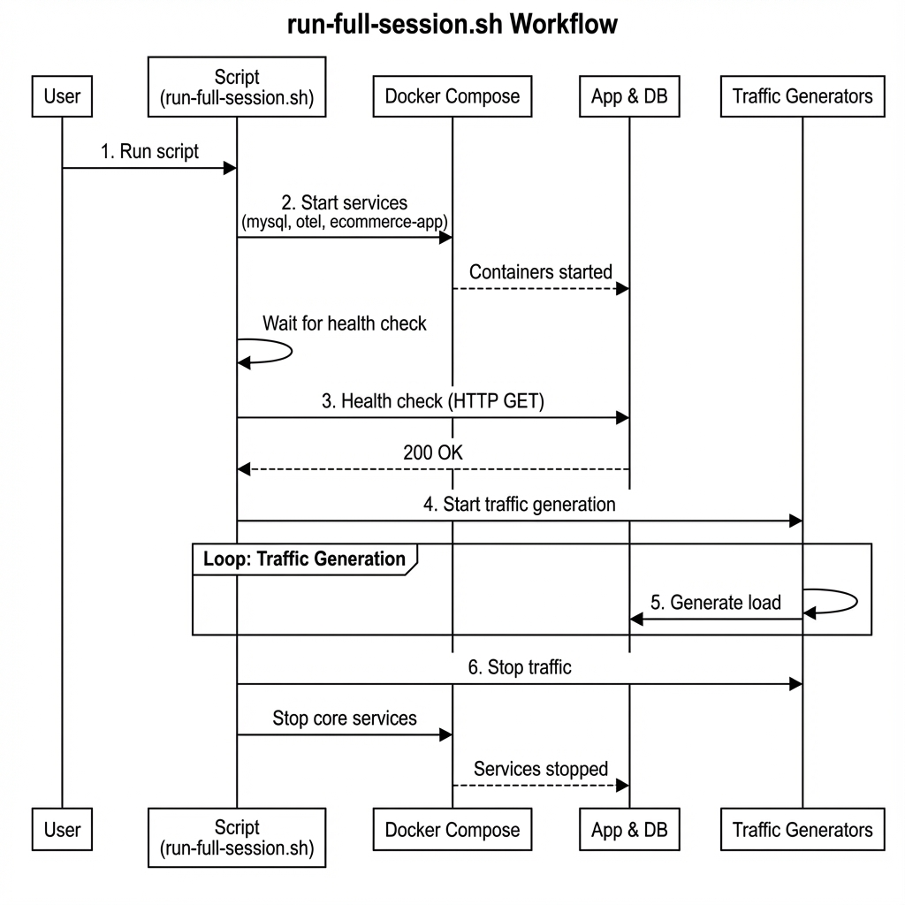

# E-commerce Go App with OpenTelemetry

This is a sample E-commerce application written in Go, instrumented with OpenTelemetry to demonstrate full-stack observability with SigNoz.

## Architecture

The application consists of a Go backend service, a MySQL database, and a traffic generation system. Telemetry data (metrics and traces) is sent to an OpenTelemetry Collector, which then forwards it to SigNoz.



## Testing Architecture

We use a consolidated script `run-full-session.sh` to manage the entire lifecycle of a testing session. This ensures a consistent environment for generating telemetry data.



## Running the Application

### Prerequisites
- Docker and Docker Compose
- `curl`

### Run a Full Session
The easiest way to run the application and generate data is using the provided script:

```bash
# Run for default duration (15 minutes)
./run-full-session.sh

# Run for a custom duration (e.g., 5 minutes)
DURATION=300 ./run-full-session.sh
```

This script will:
1.  Start MySQL, OTEL Collector, and the E-commerce App.
2.  Wait for services to be healthy.
3.  Start 4 concurrent traffic generator containers simulating different users.
4.  Run for the specified duration.
5.  Gracefully shut down all containers.

## Exported Metrics

The application is instrumented to export the following OpenTelemetry metrics:

### Business Metrics
| Metric Name | Type | Description |
|------------|------|-------------|
| `orders_created_total` | Counter | Total number of orders created |
| `revenue_total` | Counter | Total revenue generated (USD) |
| `products_viewed_total` | Counter | Total number of product views |
| `inventory_level` | Gauge | Current inventory level for products |
| `cart_items_count` | Gauge | Current number of items in user carts |

### HTTP Metrics
| Metric Name | Type | Description |
|------------|------|-------------|
| `http.server.request.count` | Counter | Total number of HTTP requests |
| `http.server.request.error.count` | Counter | Total number of HTTP error requests |
| `http.server.request.duration` | Histogram | HTTP request duration in milliseconds |

### Database Metrics
| Metric Name | Type | Description |
|------------|------|-------------|
| `db.client.queries.count` | Counter | Total number of database queries |
| `db.client.queries.duration` | Histogram | Database query duration in milliseconds |

### Application Metrics
| Metric Name | Type | Description |
|------------|------|-------------|
| `active_users_count` | Gauge | Currently active users |
| `active_carts_count` | Gauge | Number of active carts with items |
| `cache_hits_total` | Counter | Total number of cache hits |
| `cache_misses_total` | Counter | Total number of cache misses |
