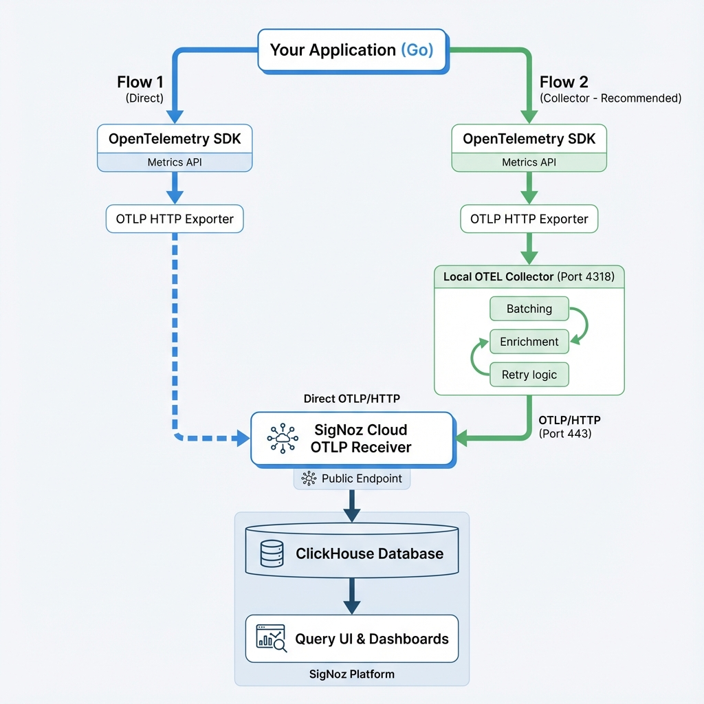

# Complete SigNoz Cloud Setup Guide for E-Commerce Application

**Document Version:** 1.0  
**Last Updated:** January 2026  
**Target Audience:** Developers, DevOps Engineers, SREs

---

## Table of Contents

1. [Overview](#overview)
2. [Prerequisites](#prerequisites)
3. [Architecture & Decision Tree](#architecture--decision-tree)
4. [Step-by-Step Setup](#step-by-step-setup)
5. [Metrics Configuration](#metrics-configuration)
6. [OTLP Receiver Setup](#otlp-receiver-setup)
7. [Exporting Metrics from Your Application](#exporting-metrics-from-your-application)
8. [Resource Attributes](#resource-attributes)
9. [Querying & Visualization](#querying-metrics)
10. [ClickHouse SQL for Observability (Learning Path)](#clickhouse-sql-learning-path)
11. [Metric Types & Aggregations](#metric-types--aggregations)
12. [Dashboard Query Examples](#dashboard-query-examples)
13. [Alerting Strategy](#alerting-strategy)
14. [Troubleshooting](#troubleshooting)
15. [Monitoring Database Metrics](#monitoring-database-metrics)

---

<a id="overview"></a>
## 1. Overview

This guide walks you through setting up **SigNoz Cloud** to monitor a Go application using OpenTelemetry metrics. 

> **Note:** This guide uses an **e-commerce demo application** as a working example to illustrate concepts. The patterns and code samples shown are **generalizable to any Go application** - simply adapt the metric names and business logic to your specific use case.

### What You'll Learn

- Export metrics from your Go application using OpenTelemetry
- Configure the OTLP HTTP receiver in SigNoz
- Write queries using both Query Builder and ClickHouse SQL
- Create comprehensive monitoring dashboards
- Aggregate Counter, Gauge, and Histogram metrics


### What is SigNoz?

SigNoz is an open-source APM (Application Performance Monitoring) platform that stores metrics, traces, and logs in ClickHouse for cost-effective, scalable observability.

**Key Components:**
- **OTLP Receiver**: Receives telemetry data from applications
- **ClickHouse**: Time-series database storing all metrics
- **Query UI**: Web interface for exploring metrics
- **Dashboards**: Custom visualizations of key metrics

### About the Demo Application

Throughout this guide, we reference an **e-commerce application** with the following components:
- HTTP API endpoints (products, orders, cart)
- Database operations (MySQL)
- Business transactions (orders, revenue, inventory)

**These are examples only.** You can apply the same patterns to:
- Microservices
- APIs of any type (REST, GraphQL, gRPC)
- Background workers
- Any Go application that needs observability


---

<a id="prerequisites"></a>
## 2. Prerequisites

Before you begin, ensure you have the following:

### 🛠️ Required Tools
- **Go 1.19+**: [Download Go](https://go.dev/dl/)
- **Docker & Docker Compose**: For running the OTEL Collector and MySQL. [Get Docker](https://docs.docker.com/get-docker/)
- **Git**: To clone the repository.

### ☁️ SigNoz Cloud Account
1. Create account at [SigNoz Cloud](https://signoz.io/cloud)
2. Create a new project
3. Get your **Ingestion Key** from **Settings** → **Ingestion Settings**
4. Note your **Region** (US, EU, or IN)

**[SCREENSHOT: SigNoz Cloud Ingestion Settings page showing the ingestion key field and region selector]**
*Figure 1: SigNoz Cloud Ingestion Settings showing where to find your key and region*

### 🔑 Environment Variables (Complete List)

| Variable | Description | Example |
|----------|-------------|---------|
| `OTEL_EXPORTER_OTLP_ENDPOINT` | Collector or Cloud endpoint | `localhost:4318` or `ingest.us.signoz.cloud:443` |
| `OTEL_EXPORTER_OTLP_INSECURE` | Use HTTP (local) or HTTPS (cloud) | `true` (local) or `false` (cloud) |
| `OTEL_EXPORTER_OTLP_HEADERS` | Auth headers (if needed) | `signoz-ingestion-key=<your-key>` |
| `OTEL_SERVICE_NAME` | Service identifier in dashboards | `ecommerce-go-app` |
| `OTEL_SERVICE_VERSION` | Application version | `1.0.0` |
| `OTEL_DEPLOYMENT_ENVIRONMENT` | Environment tag | `production`, `staging`, `development` |

### ✅ Checklist: Ready to Start?

- [ ] Go 1.19+ installed (`go version`)
- [ ] MySQL running and accessible
- [ ] Docker/Docker Compose installed (`docker --version`)
- [ ] SigNoz Cloud account created
- [ ] Ingestion Key copied to `.env` file
- [ ] All required Go packages downloaded (`go mod tidy`)

---

<a id="architecture--decision-tree"></a>
## 3. Architecture & Decision Tree

### Decision Tree

```
START: How do you want to export metrics?
  │
  ├─→ Q1: Are you in development/testing?
  │   ├─ YES → Consider Direct to Cloud (simpler)
  │   └─ NO → Continue to Q2
  │
  ├─→ Q2: Do you need advanced features?
  │   │   (Batching, enrichment, multi-destination)
  │   ├─ YES → Use OTEL Collector
  │   └─ NO → Direct to Cloud is fine
  │
  └─→ Q3: Will you run multiple applications?
      ├─ YES → OTEL Collector (single point of auth)
      └─ NO → Either approach works
```

### Comparison Matrix

| Feature | Direct Export | OTEL Collector |
|---------|---------------|----------------|
| **Setup Complexity** | ⭐ Simple | ⭐⭐⭐ Complex |
| **Development Speed** | ⭐⭐⭐ Fast | ⭐⭐ Slower |
| **Network Reliability** | ⭐ App handles failures | ⭐⭐⭐ Collector handles retry |
| **Resource Usage** | ⭐⭐ Lightweight | ⭐ Heavier (extra service) |
| **Multi-app Support** | ❌ Each app needs auth | ✅ Single collector, many apps |
| **Batch Processing** | ⭐⭐ Basic | ⭐⭐⭐ Advanced |
| **Recommended For** | Dev/testing, simple apps | **Production**, microservices |

### Migration Path

```
Development Phase
├─ Use: Direct Export (faster iteration)
│
Production Rollout
├─ Switch to: OTEL Collector
│  (Collector handles connection issues)
```

### Recommended Architecture (Option B)


*Figure 2: Data flow architecture showing both direct export and OTEL Collector paths*

### Data Flow Stages

1. **Instrumentation** - Your application generates metrics.
2. **Collection** - The OpenTelemetry meter collects and aggregates your metrics.
3. **Export** - The OTLP HTTP exporter sends batches every 10 seconds.
4. **Storage** - ClickHouse stores your metrics with labels.
5. **Query** - You use Query Builder or ClickHouse SQL to retrieve data.
6. **Visualization** - You view the results on your dashboards.

---

<a id="step-by-step-setup"></a>
## 4. Step-by-Step Setup

### Step 1: Update Application Configuration

Create a `.env` file in your project root:

```bash
# Application Configuration (sends to LOCAL collector)
OTEL_EXPORTER_OTLP_ENDPOINT=localhost:4318
OTEL_EXPORTER_OTLP_INSECURE=true
OTEL_SERVICE_NAME=ecommerce-go-app
OTEL_SERVICE_VERSION=1.0.0
OTEL_DEPLOYMENT_ENVIRONMENT=production

# Other Application Settings
APP_PORT=8080
DB_HOST=localhost
DB_PORT=3306
```

> **Important:** Notice we point to `localhost:4318` (the collector), NOT directly to SigNoz Cloud.

### Step 2: Verify OpenTelemetry Dependencies

```bash
go mod tidy

# Required packages:
# go.opentelemetry.io/otel
# go.opentelemetry.io/otel/exporters/otlp/otlpmetric/otlpmetrichttp
# go.opentelemetry.io/otel/sdk/metric
# go.opentelemetry.io/otel/sdk/resource
# go.opentelemetry.io/otel/semconv/v1.37.0
```

### Step 3: Configure OTEL Collector

Create `otel-collector-config.yaml`:

```yaml
receivers:
  otlp:
    protocols:
      http:
        endpoint: 0.0.0.0:4318  # Application sends here

processors:
  batch:
    send_batch_size: 50
    timeout: 5s
  
  resource:
    attributes:
      - key: service.name
        value: ecommerce-go-app
        action: upsert
      - key: deployment.environment
        value: production
        action: upsert

exporters:
  otlphttp:
    endpoint: https://ingest.us.signoz.cloud:443  # Replace 'us' with your region
    headers:
      signoz-ingestion-key: "<YOUR_SIGNOZ_INGESTION_KEY>"  # From Step 1

service:
  pipelines:
    metrics:
      receivers: [otlp]
      processors: [batch, resource]
      exporters: [otlphttp]
    traces:
      receivers: [otlp]
      processors: [batch, resource]
      exporters: [otlphttp]
```

**Key Configuration Points:**
- Replace `<YOUR_SIGNOZ_INGESTION_KEY>` with your actual key
- Replace `us` in endpoint with your region (`us`, `eu`, or `in`)
- The `resource` processor adds attributes to ALL metrics

### Step 4: Start OTEL Collector

```bash
# Using Docker
docker run -d --name otel-collector \
  -p 4318:4318 \
  -v $(pwd)/otel-collector-config.yaml:/etc/otelcol/config.yaml \
  otel/opentelemetry-collector-contrib:latest

# Or using docker-compose (if you have docker-compose.yaml)
docker-compose up -d otel-collector
```

**Verify collector is running:**
```bash
docker logs otel-collector
# Should see: "Everything is ready. Begin running and processing data."
```

```go
type Config struct {
    OTELExporterOTLPEndpoint     string
    OTELExporterOTLPHeaders      string
    OTELExporterOTLPInsecure     bool
    OTELServiceName              string
    OTELServiceVersion           string
    OTELDeploymentEnvironment    string
}

func LoadConfig() *Config {
    return &Config{
        OTELExporterOTLPEndpoint:  getEnv("OTEL_EXPORTER_OTLP_ENDPOINT", "localhost:4318"),
        OTELExporterOTLPHeaders:   getEnv("OTEL_EXPORTER_OTLP_HEADERS", ""),
        OTELExporterOTLPInsecure:  getEnvBool("OTEL_EXPORTER_OTLP_INSECURE", false),
        OTELServiceName:           getEnv("OTEL_SERVICE_NAME", "ecommerce-app"),
        OTELServiceVersion:        getEnv("OTEL_SERVICE_VERSION", "1.0.0"),
        OTELDeploymentEnvironment: getEnv("OTEL_DEPLOYMENT_ENVIRONMENT", "development"),
    }
}
```

### Step 5: Initialize Metrics in Your Application

**Example from demo application** (adapt to your app's structure):

In your `main.go`:

```go
func InitMetrics(ctx context.Context, cfg *config.Config) (*AppMetrics, *sdkmetric.MeterProvider, error) {
    // 1. Create Resource
    res, _ := resource.New(ctx, resource.WithAttributes(
        semconv.ServiceName(cfg.OTELServiceName),
        attribute.String("env", cfg.OTELDeploymentEnvironment),
        // ... other attributes
    ))

    // 2. Create Exporter (Local Collector)
    exporter, err := otlpmetrichttp.New(ctx,
        otlpmetrichttp.WithEndpoint(cfg.OTELExporterOTLPEndpoint), // localhost:4318
        otlpmetrichttp.WithInsecure(),
        // ... other options
    )
    if err != nil {
        return nil, nil, fmt.Errorf("exporter error: %w", err)
    }

    // 3. Create Provider (Exports every 10s)
    provider := sdkmetric.NewMeterProvider(
        sdkmetric.WithResource(res),
        sdkmetric.WithReader(sdkmetric.NewPeriodicReader(exporter, sdkmetric.WithInterval(10*time.Second))),
    )

    otel.SetMeterProvider(provider)
    
    // 4. Initialize App Metrics
    appMetrics := NewAppMetrics(provider.Meter(cfg.OTELServiceName))

    return appMetrics, provider, nil
}
```

**Key Points:**
1. **InitMetrics** creates the meter provider and returns it
2. **defer meterProvider.Shutdown()** ensures metrics are flushed on exit
3. **MetricsMiddleware** is where HTTP metrics are actually recorded
4. The exporter automatically sends batches every 10 seconds

### Step 6: Run the Application

Now that everything is configured, let's start the application and verify the entire pipeline.

1.  **Load Environment Variables:**
    Ensure your `.env` file is in the root directory.

2.  **Run the Go Application:**
    ```bash
    go run main.go
    ```

3.  **Verify Output:**
    You should see logs indicating the server started and is sending metrics to the collector:
    ```text
    2026/01/05 10:00:00 Server starting on port 8080
    2026/01/05 10:00:00 Sending metrics to: localhost:4318
    ```

4.  **Generate Traffic & Verify:**

    **Terminal 1 (Generate Requests):**
    ```bash
    # Make a few requests to generate metrics
    curl http://localhost:8080/api/v1/products
    curl -X POST http://localhost:8080/api/v1/orders
    ```

    **Terminal 2 (Check Collector Logs):**
    ```bash
    docker logs otel-collector | tail -20
    # Expected: "metrics_exporter: metrics received and exported successfully"
    ```

    **Terminal 3 (Check Application Logs):**
    ```bash
    # Expected: GET /api/v1/products - 200 - 45ms
    ```

### Step 7: Import the Dashboard

You can import the provided `dashboard.json` directly into SigNoz to get a pre-configured view of your metrics.

1.  Go to **Dashboards** in the SigNoz sidebar.
2.  Click **New Dashboard** -> **Import JSON**.
3.  Upload or paste the content of [`dashboard.json`](https://github.com/coolwednesday/signoz-metrics-ecommerce-app-demo/blob/main/docs/dashboard.json).

**Panel Types Included:**
- **Value Panels:** Single number displays (e.g., Total Requests, Error Rate).
- **Time Series Graphs:** Line charts showing trends over time (e.g., Requests per Minute).
- **Tables:** Tabular data for detailed analysis (e.g., Slow Queries).

---

<a id="metrics-configuration"></a>
## 5. Metrics Configuration

### Example Metrics from Demo Application

The following metrics are implemented in our **e-commerce demo** to illustrate different metric types. 

> **For Your Application:** Replace these with metrics relevant to your domain (e.g., payment processing, user authentication, data processing, etc.).

#### HTTP Metrics

| Metric | Type | Unit | Description | **Business Context / Why it matters** |
| :--- | :--- | :--- | :--- | :--- |
| `http.server.request.count` | Counter | 1 | Total HTTP requests received | **Traffic Volume:** Measures system load and adoption. |
| `http.server.request.error.count` | Counter | 1 | Total failed HTTP requests (4xx/5xx) | **Reliability:** High errors = unhappy users & lost revenue. |
| `http.server.request.duration` | Histogram | ms | Request latency distribution | **User Experience:** Slow apps drive customers away. |

#### Database Metrics

| Metric | Type | Unit | Description | **Business Context / Why it matters** |
| :--- | :--- | :--- | :--- | :--- |
| `db.client.queries.count` | Counter | 1 | Total database queries executed | **DB Load:** High count may indicate N+1 query issues. |
| `db.client.queries.duration` | Histogram | ms | Query execution time distribution | **Bottlenecks:** Slow DB queries are the #1 cause of API slowness. |

#### Business Metrics

| Metric | Type | Unit | Description | **Business Context / Why it matters** |
| :--- | :--- | :--- | :--- | :--- |
| `orders_created_total` | Counter | 1 | Total orders created | **Revenue:** The most critical KPI. Zero = Emergency. |
| `products_viewed_total` | Counter | 1 | Product page views | **Engagement:** Measures interest and marketing effectiveness. |
| `revenue_total` | Counter | USD | Total revenue generated | **Financial Health:** Real-time view of earnings. |
| `inventory_level` | Gauge | 1 | Current stock levels | **Supply Chain:** Prevents selling out-of-stock items. |
| `cart_items_count` | Gauge | 1 | Items in active user carts | **Sales Pipeline:** High cart count + low orders = checkout friction. |

#### Application Metrics

| Metric | Type | Unit | Description | **Business Context / Why it matters** |
| :--- | :--- | :--- | :--- | :--- |
| `active_users_count` | Gauge | 1 | Concurrent active users | **Growth:** Real-time usage tracking. |
| `active_carts_count` | Gauge | 1 | Carts with at least one item | **Conversion Potential:** Users intending to buy. |
| `cache_hits_total` | Counter | 1 | Cache hit count | **Efficiency:** High hits = faster app & lower DB cost. |
| `cache_misses_total` | Counter | 1 | Cache miss count | **Performance:** High misses = potential latency spikes. |

---

<a id="otlp-receiver-setup"></a>
## 6. OTLP Receiver Setup

### What is OTLP?

**OpenTelemetry Protocol (OTLP)** is a vendor-neutral protocol for sending telemetry data. SigNoz provides an OTLP HTTP receiver.

### Collector Configuration

We use the **OTEL Collector** as an intermediary to handle batching, retries, and authentication.

**Complete Collector Configuration:**

```yaml
# otel-collector-config.yaml
receivers:
  otlp:
    protocols:
      http:
        endpoint: 0.0.0.0:4318  # App sends here (HTTP, no auth needed)

processors:
  batch:
    send_batch_size: 50
    timeout: 5s  # Wait max 5s before sending batch
  
  resource:
    attributes:
      - key: service.name
        value: ecommerce-go-app
        action: upsert  # Override if app sets it
      - key: deployment.environment
        value: production
        action: upsert

exporters:
  otlphttp:
    endpoint: https://ingest.us.signoz.cloud:443  # SigNoz Cloud
    headers:
      signoz-ingestion-key: "your-key-here"  # Authentication

service:
  pipelines:
    metrics:
      receivers: [otlp]  # Receive from app
      processors: [batch, resource]  # Process in order
      exporters: [otlphttp]  # Send to SigNoz
```

**Key Collector Features:**

1. **Batching Processor**: Groups metrics to reduce API calls
2. **Resource Processor**: Adds deployment info to ALL metrics
3. **Retry Logic**: Built-in retry on network failures
4. **Memory Buffer**: Handles temporary network issues

### Receiver Configuration in SigNoz Cloud

The OTLP HTTP receiver is **automatically enabled** in SigNoz Cloud. You don't need to configure it manually.

**Default Settings:**
- **Protocol**: HTTP/1.1
- **Port**: 4318
- **Endpoint Path**: `/v1/metrics` (for metrics)
- **Authentication**: Via `signoz-ingestion-key` header
- **TLS**: Enabled (HTTPS)

### Metrics Export Interval

Metrics are exported in batches:
- **Export Interval**: 10 seconds
- **Batch Size**: Configurable
- **Timeout**: 30 seconds

### Verify Metrics Are Being Received

1. Go to SigNoz Cloud → **Metrics** tab
2. Look for your service name: `ecommerce-go-app`
3. Check "Metrics Explorer" for available metrics
4. Filter by `service.name = 'ecommerce-go-app'`

**[SCREENSHOT: SigNoz Metrics Explorer showing the service dropdown and available metrics list]**
*Figure 3: Metrics Explorer showing available metrics for the ecommerce-go-app service*

---

<a id="exporting-metrics-from-your-application"></a>
## 7. Exporting Metrics from Your Application

### Complete Metrics Initialization Code
[View source on GitHub](https://github.com/coolwednesday/signoz-metrics-ecommerce-app-demo/blob/main/internal/metrics/metrics.go#L48-L185)

```go
// internal/metrics/metrics.go
package metrics

import (
    "context"
    "fmt"
    "time"

    "go.opentelemetry.io/otel"
    "go.opentelemetry.io/otel/attribute"
    "go.opentelemetry.io/otel/exporters/otlp/otlpmetric/otlpmetrichttp"
    "go.opentelemetry.io/otel/metric"
    sdkmetric "go.opentelemetry.io/otel/sdk/metric"
    "go.opentelemetry.io/otel/sdk/resource"
    semconv "go.opentelemetry.io/otel/semconv/v1.37.0"
)

type AppMetrics struct {
    HTTPRequestsTotal   metric.Int64Counter
    HTTPRequestsErrors  metric.Int64Counter
    HTTPRequestDuration metric.Float64Histogram
    // ... other metrics
    serviceName         string
}

// InitMetrics initializes the OTLP exporter and creates the meter provider.
// (See "Step 5" for the full implementation of this function)
```

### Recording Metrics in HTTP Middleware
[View source on GitHub](https://github.com/coolwednesday/signoz-metrics-ecommerce-app-demo/blob/main/internal/middleware/middleware.go#L17-L81)

```go
// internal/middleware/middleware.go
func MetricsMiddleware(metrics *metrics.AppMetrics) mux.MiddlewareFunc {
    return func(next http.Handler) http.Handler {
        return http.HandlerFunc(func(w http.ResponseWriter, r *http.Request) {
            start := time.Now()
            rw := &responseWriter{ResponseWriter: w, statusCode: http.StatusOK}

            next.ServeHTTP(rw, r)

            duration := time.Since(start).Milliseconds()
            route := getRoutePattern(r) // Get route template

            ctx := r.Context()
            attrs := []attribute.KeyValue{
                attribute.String("http.method", r.Method),
                attribute.String("http.route", route),
                attribute.Int("http.status_code", rw.statusCode),
            }

            // Record metrics
            metrics.HTTPRequestsTotal.Add(ctx, 1, metric.WithAttributes(metrics.WithServiceName(attrs)...))

            if rw.statusCode >= 400 {
                metrics.HTTPRequestsErrors.Add(ctx, 1, metric.WithAttributes(metrics.WithServiceName(attrs)...))
            }

            metrics.HTTPRequestDuration.Record(ctx, float64(duration), metric.WithAttributes(metrics.WithServiceName(attrs)...))
        })
    }
}
```

---

<a id="resource-attributes"></a>
## 8. Resource Attributes

Resource attributes identify your application and are automatically attached to all metrics.

### Standard Resource Attributes

```go
resource.New(ctx,
    resource.WithAttributes(
        // Service information
        semconv.ServiceName("ecommerce-go-app"),
        semconv.ServiceVersion("1.0.0"),
        
        // Deployment information
        attribute.String("deployment.environment", "production"),
        
        // Optional: Additional context
        attribute.String("team", "platform"),
        attribute.String("region", "us-east-1"),
    ),
)
```

### Service Name - Critical Attribute

Your service name MUST be set correctly for queries to work:

```go
semconv.ServiceName("ecommerce-go-app")
```

**Why it matters:**
- All queries filter by `service.name = 'ecommerce-go-app'`
- Allows monitoring multiple services
- Required for dashboard filtering

---

<a id="querying-metrics"></a>
## 9. Querying & Visualization

SigNoz provides a tiered approach to querying metrics, from visual building to advanced SQL.

### 9.1 Query Builder (Recommended for Most Users)

**Location:** SigNoz → Metrics → Query Builder

**Components:**
- **Metric Name**: Select from dropdown
- **Aggregation**: Sum, Average, Max, Min, etc.
- **Filters**: Filter by attributes like `service.name`, `http.route`
- **Legend**: Display format

**[SCREENSHOT: SigNoz Query Builder interface showing metric selection, aggregation options, and filter fields]**
*Figure 4: Query Builder interface for constructing metric queries visually*

### 9.2 Creating Your First Custom Panel

#### Step 1: Create New Panel
1. Go to your Dashboard.
2. Click **"Add Panel"** (top right).
3. Choose panel type:
   - **Stat:** Single value (e.g., "1,234 total requests").
   - **Time Series:** Line/area chart (e.g., requests over time).
   - **Table:** Detailed data (e.g., slow queries list).

#### Step 2: Configure Metric Query (Example: Total Orders)
```text
Metric Name: orders_created_total
Aggregation: Sum
Space Aggregation: Sum
Time Aggregation: Sum
Filter: service.name = 'ecommerce-go-app'
Legend: "Total Orders"
```

#### Step 3: Customize Visualization
- **Title:** "Orders Created"
- **Unit:** Numbers
- **Color:** Green (success indicator)
- **Threshold:** Warning at 100, Critical at 50

#### Step 4: Save Panel
1. Click **"Save Panel"**.
2. Name: "Orders Created".
3. Description: "Track total orders created over time".

### 9.3 Common Dashboard Patterns

#### Pattern 1: KPI Dashboard (Executive View)
- **Purpose:** Show business metrics at a glance.
- **Panels:** Total Revenue (Stat), Total Orders (Stat), Active Users (Stat).
- **Time Range:** Last 24 hours.

#### Pattern 2: API Performance Dashboard (Engineering)
- **Purpose:** Monitor API health.
- **Panels:** Request Rate (Time Series), Error Rate (Time Series), P95 Latency (Time Series).
- **Time Range:** Last 1 hour.

#### Pattern 3: Database Performance (DBA)
- **Purpose:** Monitor database health.
- **Panels:** Query Count/sec, Slow Queries (>500ms), Connection Pool Usage.

---

<a id="clickhouse-sql-learning-path"></a>
## 10. ClickHouse SQL for Observability (Learning Path)

### Level 1: Basic Queries (No SQL Knowledge Required)
**Recommendation:** Use the **Query Builder interface**. It covers 80% of use cases without writing code.

### Level 2: Intermediate Queries (Some SQL Knowledge)
**When to use:** You need to combine multiple metrics or use logic not available in the builder.

**Example: "Get total requests per route"**
```sql
SELECT
    JSONExtractString(ts.labels, 'http.route') AS route,
    sum(delta) AS request_count
FROM (
    SELECT
        fingerprint,
        greatest(0, max(value) - min(value)) AS delta
    FROM signoz_metrics.distributed_samples_v4
    WHERE metric_name = 'http.server.request.count'
    GROUP BY fingerprint
)
INNER JOIN signoz_metrics.distributed_time_series_v4 AS ts USING (fingerprint)
GROUP BY route
ORDER BY request_count DESC
```

### Level 3: Advanced Queries (Percentiles)
**When to use:** You need accurate P95/P99 percentiles from histograms.

**Why it's complex:** Histograms store data in buckets. You need special functions like `quantileTDigestWeighted`.

**Simplified Example:**
```sql
SELECT
    quantileTDigestWeighted(0.95)(le_num, bucket_count) AS p95_ms
FROM (
    -- Complex subquery extracting buckets
)
```
**Best Practice:** For percentiles, **use the Query Builder's Histogram panel**. It handles the math automatically.

### Avoiding Slow Queries
❌ **Bad:** `SELECT * FROM distributed_samples_v4` (Scans millions of rows)
✅ **Good:** Always filter by `unix_milli` and `fingerprint`.


---

<a id="metric-types--aggregations"></a>
## 11. Metric Types & Aggregations

### 1. Counter Metrics

**What:** Cumulative value that only increases

**Examples:** Request count, error count, orders created

**ClickHouse SQL (Total Requests):**
```sql
SELECT
    sum(delta) AS total_requests
FROM
(
    SELECT
        s.fingerprint,
        max(s.value) - min(s.value) AS delta
    FROM signoz_metrics.distributed_samples_v4 AS s
    INNER JOIN signoz_metrics.distributed_time_series_v4 AS ts USING (fingerprint)
    WHERE s.metric_name = 'http.server.request.count'
      AND s.unix_milli BETWEEN {{.start_timestamp_ms}} AND {{.end_timestamp_ms}}
      AND JSONExtractString(ts.labels, 'service.name') = 'ecommerce-go-app'
    GROUP BY s.fingerprint
)
```

> **Functions Used:**
> - [`sum`](https://clickhouse.com/docs/en/sql-reference/aggregate-functions/reference/sum): Aggregates the delta values.

### 2. Gauge Metrics

**What:** Point-in-time measurement (can go up or down)

**Examples:** Active users, inventory level, cache size

**ClickHouse SQL (Avg Latency):**
```sql
SELECT
    sum(delta_sum) / sum(delta_count) AS avg_latency_ms
FROM
(
    SELECT
        fingerprint,
        maxIf(value, metric_name = 'http.server.request.duration.sum')
        -
        minIf(value, metric_name = 'http.server.request.duration.sum')
            AS delta_sum,
        maxIf(value, metric_name = 'http.server.request.duration.count')
        -
        minIf(value, metric_name = 'http.server.request.duration.count')
            AS delta_count
    FROM signoz_metrics.distributed_samples_v4
    WHERE metric_name IN (
        'http.server.request.duration.sum',
        'http.server.request.duration.count'
    )
      AND unix_milli BETWEEN {{.start_timestamp_ms}} AND {{.end_timestamp_ms}}
      AND fingerprint IN (
          SELECT fingerprint
          FROM signoz_metrics.distributed_time_series_v4
          WHERE JSONExtractString(labels,'service.name') = 'ecommerce-go-app'
      )
    GROUP BY fingerprint
)
```

> **Functions Used:**
> - [`maxIf`](https://clickhouse.com/docs/en/sql-reference/aggregate-functions/reference/maxif): Gets the maximum value if the condition is met.


### 3. Histogram Metrics

**What:** Distribution of values in buckets (latency ranges)

**Examples:** Request duration, query latency

**ClickHouse SQL (P95 Latency):**
```sql
SELECT
    toStartOfInterval(
        toDateTime(intDiv(s.unix_milli, 1000)),
        toIntervalMinute(1)
    ) AS ts,
    quantileTDigestWeighted(0.95)(le_num, bucket_count) AS p95_ms
FROM (
    SELECT
        toFloat64OrNull(JSONExtractString(ts.labels,'le')) AS le_num,
        toUInt64(
            greatest(0, s.value - lagInFrame(s.value, 1, s.value)
                OVER (PARTITION BY s.fingerprint, JSONExtractString(ts.labels,'le')
                      ORDER BY s.unix_milli))
        ) AS bucket_count
    FROM signoz_metrics.distributed_samples_v4 AS s
    INNER JOIN signoz_metrics.distributed_time_series_v4 AS ts USING(fingerprint)
    WHERE s.metric_name = 'http.server.request.duration.bucket'
      AND s.unix_milli BETWEEN {{.start_timestamp_ms}} AND {{.end_timestamp_ms}}
      AND JSONExtractString(ts.labels,'service.name') = 'ecommerce-go-app'
      AND JSONExtractString(ts.labels,'le') != '+Inf'
)
WHERE le_num IS NOT NULL
GROUP BY ts
ORDER BY ts
```

> **Functions Used:**
> - [`quantileTDigestWeighted`](https://clickhouse.com/docs/en/sql-reference/aggregate-functions/reference/quantiletdigestweighted): Calculates accurate percentiles for histograms.
> - [`JSONExtractString`](https://clickhouse.com/docs/en/sql-reference/functions/json-functions#jsonextractstring): Extracts values from the labels JSON.


---

<a id="dashboard-query-examples"></a>
## 12. Dashboard Query Examples

### Example 1: Total Requests (Single Value)

**ClickHouse SQL:**
```sql
SELECT
    sum(delta) AS total_requests
FROM (
    SELECT
        greatest(0, max(value) - min(value)) AS delta
    FROM signoz_metrics.distributed_samples_v4
    WHERE metric_name = 'http.server.request.count'
      AND unix_milli BETWEEN {{.start_timestamp_ms}} AND {{.end_timestamp_ms}}
      AND fingerprint IN (
            SELECT fingerprint FROM signoz_metrics.distributed_time_series_v4
            WHERE JSONExtractString(labels,'service.name') = 'ecommerce-go-app'
      )
    GROUP BY fingerprint
)
```

**[SCREENSHOT: Total Requests panel showing a single value count]**
*Figure 6: Total Requests panel visualization*

### Example 2: Error Rate Percentage

**ClickHouse SQL:**
```sql
WITH error_stats AS (
    SELECT
        sum(if(metric_name = 'http.server.request.error.count', delta, 0)) AS error_count,
        sum(if(metric_name = 'http.server.request.count', delta, 0)) AS total_count
    FROM (
        SELECT
            metric_name,
            greatest(0, max(value) - min(value)) AS delta
        FROM signoz_metrics.distributed_samples_v4
        WHERE metric_name IN ('http.server.request.error.count', 'http.server.request.count')
          AND unix_milli BETWEEN {{.start_timestamp_ms}} AND {{.end_timestamp_ms}}
          AND fingerprint IN (
                SELECT fingerprint FROM signoz_metrics.distributed_time_series_v4
                WHERE JSONExtractString(labels,'service.name') = 'ecommerce-go-app'
          )
        GROUP BY metric_name, fingerprint
    )
)
SELECT
    if(total_count > 0, (error_count / total_count) * 100, 0) AS error_rate_percent
FROM error_stats
```

**[SCREENSHOT: Error Rate panel showing the calculated percentage]**
*Figure 7: Error Rate panel visualization*

### Example 3: Requests by Route (Group By)

**ClickHouse SQL:**
```sql
SELECT
    JSONExtractString(ts.labels, 'http.route') AS route,
    sum(delta) AS request_count
FROM (
    SELECT
        ts.fingerprint,
        greatest(0, max(s.value) - min(s.value)) AS delta
    FROM signoz_metrics.distributed_samples_v4 AS s
    INNER JOIN signoz_metrics.distributed_time_series_v4 AS ts USING (fingerprint)
    WHERE s.metric_name = 'http.server.request.count'
      AND s.unix_milli BETWEEN {{.start_timestamp_ms}} AND {{.end_timestamp_ms}}
      AND JSONExtractString(ts.labels, 'service.name') = 'ecommerce-go-app'
    GROUP BY ts.fingerprint
)
GROUP BY route
ORDER BY request_count DESC
```

---

<a id="alerting-strategy"></a>
## 13. Alerting Strategy

Monitoring is only useful if you know when things break. Here is a recommended alerting strategy for this application.

### 🚨 Critical Alerts (Page the On-Call)

These indicate the application is broken or severely degraded.

| Alert Name | Condition | Threshold | Why it matters |
| :--- | :--- | :--- | :--- |
| **High Error Rate** | `http.server.request.error.count` / `total` | > 5% for 5m | Users are failing to complete actions. |
| **High Latency (P95)** | `http.server.request.duration` (P95) | > 500ms for 5m | App is too slow, users will drop off. |
| **Database Slow** | `db.client.queries.duration` (P95) | > 200ms for 5m | Database bottlenecks will cascade to API. |

### ⚠️ Warning Alerts (Notify via Slack/Email)

These indicate potential issues that need attention but aren't urgent.

| Alert Name | Condition | Threshold | Why it matters |
| :--- | :--- | :--- | :--- |
| **Inventory Low** | `inventory_level` | < 10 items | Stock is running out, need to restock. |
| **Zero Active Carts** | `active_carts_count` | = 0 for 15m | Potential checkout flow breakage. |
| **High Cache Misses** | `cache_misses_total` | > 50% increase | Performance degradation risk. |

### How to Set Up Alerts in SigNoz

1.  Go to **Alerts** in the sidebar.
2.  Click **New Alert**.
3.  Choose **Metric Query**.
4.  Use the **Query Builder** to select the metric (e.g., `http.server.request.error.count`).
5.  Set the threshold (e.g., `> 0`).
6.  Configure notification channels (Slack, PagerDuty, Webhook).

> **💡 Pro Tip: Alert Evaluation**
> - Use **"At Least Once"** for critical errors (e.g., if error rate > 5% even once).
> - Use **"On Average"** for latency metrics to avoid noise from single slow requests.
> - Use **"In Total"** carefully with counters; usually, you want to compare rates.

---

<a id="troubleshooting"></a>
## 14. Troubleshooting

We've organized troubleshooting by the lifecycle stage where issues typically occur.

### Phase 1: Setup & Connectivity

#### 🔴 Issue: "Connection Refused" errors in App Logs
- **Cause:** Application cannot reach the OTEL Collector.
- **Fix:** Ensure Collector is running (`docker ps`) and port `4318` is exposed. Check `OTEL_EXPORTER_OTLP_ENDPOINT=localhost:4318`.

#### 🔴 Issue: Collector "Unauthorized" or "401"
- **Cause:** Invalid Ingestion Key.
- **Fix:** Check `signoz-ingestion-key` in `otel-collector-config.yaml`. Verify key in SigNoz Cloud Settings.

### Phase 2: Data Ingestion

#### 🟡 Issue: Metrics Not Appearing in SigNoz
**Symptoms:** No data in "Metrics Explorer" after 30 seconds.

**Checklist:**
1.  **Check Collector Logs:** `docker logs otel-collector` (Look for "Exporting failed" or "Success").
2.  **Verify Service Name:** Ensure `OTEL_SERVICE_NAME` is set correctly.
3.  **Test Connectivity:**
    ```bash
    curl -v https://ingest.us.signoz.cloud:443/v1/metrics -H "signoz-ingestion-key: <YOUR_KEY>"
    ```

### Phase 3: Querying & Dashboards

#### 🟡 Issue: "Group By" Not Working
- **Cause:** The attribute doesn't exist on the metric.
- **Fix:** Use **Metrics Explorer** to verify available labels for the specific metric.

#### 🟡 Issue: Service Not in "Services" Tab
- **Cause:** The "Services" tab relies on **Traces**, not Metrics.
- **Fix:** This is normal if you are only sending metrics. Use **Dashboards** to view your data.

#### 🟡 Issue: Histogram Data Missing (P95/P99)
- **Cause:** Querying the wrong metric name or missing buckets.
- **Fix:** Ensure you query `metric_name.bucket` (not `.sum` or `.count`) and filter out `le='+Inf'`.

### Phase 4: Data Verification (ClickHouse)

**Check if metrics are being received:**
```sql
SELECT
    metric_name,
    count() AS sample_count
FROM signoz_metrics.distributed_samples_v4
WHERE unix_milli >= now() - INTERVAL 1 HOUR
  AND fingerprint IN (
        SELECT fingerprint FROM signoz_metrics.distributed_time_series_v4
        WHERE JSONExtractString(labels,'service.name') = 'ecommerce-go-app'
  )
GROUP BY metric_name
ORDER BY sample_count DESC
```

### Phase 5: Quick Diagnostic Script

Save this as `diagnose.sh` and run it to check your entire setup:

```bash
#!/bin/bash
echo "═══════════════════════════════════════════════════════════"
echo "  SIGNOZ E-COMMERCE APP DIAGNOSTIC REPORT"
echo "═══════════════════════════════════════════════════════════"

echo "1️⃣  APPLICATION STATUS"
if ps aux | grep -i "ecommerce-app" | grep -v grep > /dev/null; then
    echo "   ✅ Application is running"
else
    echo "   ❌ Application is NOT running (Run: go run main.go)"
fi

echo ""
echo "2️⃣  OTEL COLLECTOR STATUS"
if docker ps | grep otel-collector > /dev/null; then
    echo "   ✅ OTEL Collector is running"
else
    echo "   ❌ OTEL Collector is NOT running (Run: docker-compose up -d otel-collector)"
fi

echo ""
echo "3️⃣  DATABASE CONNECTIVITY"
if nc -z localhost 3306; then
    echo "   ✅ Database port 3306 is open"
else
    echo "   ❌ Database port 3306 is closed"
fi

echo ""
echo "4️⃣  SIGNOZ CLOUD CONNECTIVITY"
# Extract key from config or env
KEY=$(grep "signoz-ingestion-key" otel-collector-config.yaml | awk -F'"' '{print $2}')
if [ -z "$KEY" ]; then KEY=$OTEL_EXPORTER_OTLP_HEADERS; fi

if curl -s -o /dev/null -w "%{http_code}" https://ingest.us.signoz.cloud:443/v1/metrics \
    -H "signoz-ingestion-key: $KEY" | grep -q "200\|400"; then
    echo "   ✅ Can reach SigNoz Cloud"
else
    echo "   ❌ Cannot reach SigNoz Cloud (Check internet or key)"
fi
echo "═══════════════════════════════════════════════════════════"
```

---

<a id="monitoring-database-metrics"></a>
## 15. Monitoring Database Metrics

To monitor your database (e.g., MySQL, PostgreSQL), you have two main approaches:

### 1. Client-Side Monitoring (Application)
This is what the `ecommerce-go-app` uses. The application itself records metrics about its interaction with the database.

- **Library:** `github.com/XSAM/otelsql`
- **Metrics:**
    - `db.client.queries.count`: Total queries executed.
    - `db.client.queries.duration`: Histogram of query latency.
    - `db.client.connections.active`: Number of active connections.

### 2. Server-Side Monitoring (Infrastructure)
For production, you should also monitor the database server itself (CPU, memory, internal counters) using the OpenTelemetry Collector.

#### Docker Setup for MySQL + OTEL Collector
You can run a sidecar collector to scrape MySQL metrics.

**`docker-compose.yaml` example:**
```yaml
version: "3"
services:
  mysql:
    image: mysql:5.7
    environment:
      - MYSQL_ROOT_PASSWORD=password
    ports:
      - "3306:3306"

  otel-collector:
    image: signoz/signoz-otel-collector:latest
    command: ["--config=/etc/otel-collector-config.yaml"]
    volumes:
      - ./otel-collector-config.yaml:/etc/otel-collector-config.yaml
    depends_on:
      - mysql
```

**`otel-collector-config.yaml` (Receiver Config):**
```yaml
receivers:
  mysql:
    endpoint: "mysql:3306"
    username: "root"
    password: "password"
    collection_interval: 10s
    metrics:
      mysql.connection.count:
        enabled: true
      mysql.query.count:
        enabled: true

service:
  pipelines:
    metrics:
      receivers: [mysql]
      exporters: [otlp]
```

### Slow Query Analysis (Example)

To find slow queries (e.g., taking longer than **100ms**), you can query the `db.client.queries.duration` histogram.

**ClickHouse SQL for Slow Queries (>500ms):**
```sql
SELECT
    JSONExtractString(ts2.labels, 'db.statement') AS query,
    JSONExtractString(ts2.labels, 'db.operation') AS operation,

    sum(sub.count) AS total_queries,

    sumIf(sub.count, sub.bucket_ms >= 500) AS slow_queries,

    (sumIf(sub.count, sub.bucket_ms >= 500) / NULLIF(sum(sub.count), 0)) * 100
        AS slow_pct
FROM
(
    SELECT
        fingerprint,
        bucket_ms,
        max_cumulative - lagInFrame(max_cumulative, 1, 0) OVER (PARTITION BY fingerprint ORDER BY bucket_ms) AS count
    FROM
    (
        SELECT
            s.fingerprint,
            toFloat64OrNull(JSONExtractString(ts.labels, 'le')) AS bucket_ms,
            max(s.value) AS max_cumulative
        FROM signoz_metrics.distributed_samples_v4 AS s
        INNER JOIN signoz_metrics.distributed_time_series_v4 AS ts ON s.fingerprint = ts.fingerprint
        WHERE
            s.metric_name = 'db.client.queries.duration.bucket'
            AND s.unix_milli >= {{.start_timestamp_ms}}
            AND s.unix_milli <  {{.end_timestamp_ms}}
            AND JSONExtractString(ts.labels, 'service.name') = 'ecommerce-go-app'
            AND JSONExtractString(ts.labels, 'le') NOT IN ('+Inf', 'inf')
        GROUP BY
            s.fingerprint,
            bucket_ms
    )
) AS sub
INNER JOIN signoz_metrics.distributed_time_series_v4 AS ts2
    ON sub.fingerprint = ts2.fingerprint
WHERE sub.count > 0
GROUP BY query, operation
ORDER BY slow_pct DESC
```

**[SCREENSHOT: Slow Queries table showing query statements and execution counts]**
*Figure 9: Slow Queries table identifying performance bottlenecks*

---

## Summary

You now have a complete setup for monitoring your application with SigNoz Cloud:

- ✅ You export metrics via the OTLP HTTP receiver.
- ✅ You use resource attributes to identify your service.
- ✅ You have both Query Builder and ClickHouse SQL capabilities.
- ✅ You have all 14 metric types implemented.
- ✅ You can use dashboard examples for common use cases.
- ✅ You have a troubleshooting guide and verification queries.

**Next Steps:**
- Deploy your application with metrics enabled.
- Create custom dashboards for your KPIs.
- Set up alerts on metric thresholds.
- Explore traces and logs alongside your metrics.

*For more details, visit the [SigNoz Documentation](https://signoz.io/docs/).*

<a id="appendix"></a>
## 16. Appendix: Source Code & Resources

- **GitHub Repository**: [coolwednesday/signoz-metrics-ecommerce-app-demo](https://github.com/coolwednesday/signoz-metrics-ecommerce-app-demo)
- **Main Application Code**: [main.go](https://github.com/coolwednesday/signoz-metrics-ecommerce-app-demo/blob/main/main.go)
- **Dashboard JSON**: [dashboard.json](https://github.com/coolwednesday/signoz-metrics-ecommerce-app-demo/blob/main/docs/dashboard.json)
